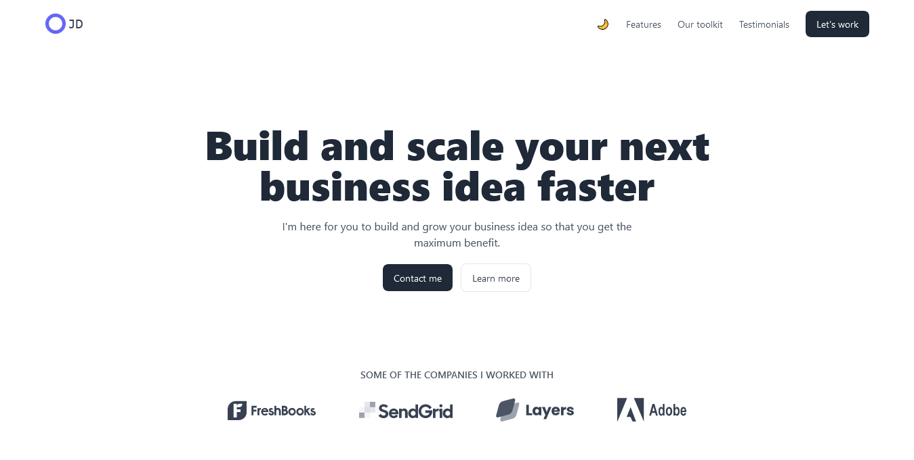
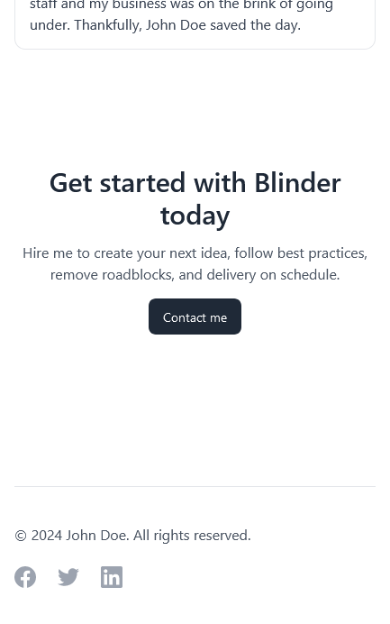

# Blinder

This is a portfolio website from float UI on which I expanded on and added tons of customization. To list some,

  - Migrated the site to app router
  - Added animations
  - Implemented dark mode feature
  - Fixed deprecated codes
  - Refactored the entire codebase
  - Pixel perfect responsiveness
  - Reusable codes for your next project too

Feel free to edit the contents and make it yours entirely.

### Tech Stack

 - Next.js
 - Tailwind CSS
 - Framer Motion

### Some Screenshots

  
  
  
  
  

